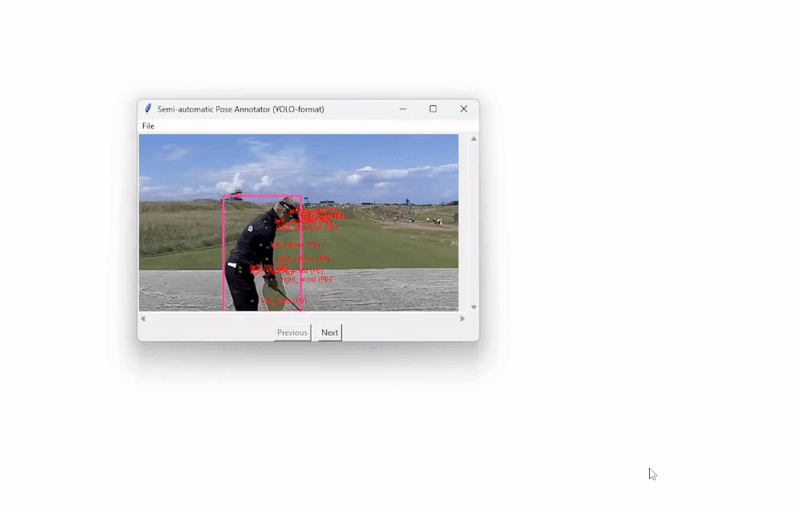

# YOLO pose annotation pipeline


## Overview
This repository provides a toolset for **automatic** and **semi-automatic** pose annotation to fine-tune **YOLO pose models** with custom datasets. The tool allows users to generate annotations efficiently and refine them as needed before training a fine-tuned YOLO pose model.

### Features
- **Fully automatic annotation**: Uses `YOLOv8x-pose` to detect keypoints and generate annotations automatically.
- **Semi-automatic annotation** (can be used independently): Provides an interactive tool where automatic pose estimation is applied to a single image at a time. The user can then manually correct keypoints by clicking and dragging.
- **Fine-tuning pipeline**: Facilitates the fine-tuning of YOLO pose models with custom datasets.



## Getting started

### 1. Clone the repository
```bash
git clone https://github.com/kevgildea/yolo-pose-annotation.git
cd yolo-pose-annotation
```

### 2. Install dependencies
Make sure you have Python installed (\>=3.8). Then, install the required packages:
```bash
pip install -r requirements.txt
```

### 3. Follow the steps in the notebook
To use the toolset, **open and follow the steps in the Jupyter notebook**:

➡️ **[YOLO Pose Annotation Pipeline Notebook](Notebooks/Tutorial.ipynb)**

This notebook provides a complete step-by-step guide on:
- Preparing the dataset (two example datasets are provided in the [datasets](datasets) folder)
- Running automatic and semi-automatic annotation
- Fine-tuning a YOLO pose model (YOLOv8s)
- Visualising results


## Contributing
Feel free to submit pull requests or open issues for improvements or bug fixes!

A few ideas:
- [ ] Add zooming and panning for small/large images.
- [ ] Enable fully manual annotation mode (draw a bounding box with a stock set of repositionable keypoints inside).
- [ ] Functionality to delete a detected bounding box entirely.
- [ ] Repositioning and resizing bounding boxes.
- [ ] Add undo/redo functionality.
- [ ] Export annotations in multiple formats, e.g., COCO.
- [ ] Add better handling of keypoint visibility labels, since currently the default is either vis=2, or vis=0 (see [documentation](resources/YOLO_annotation_format.md) for details).
- [ ] Try replacing YOLOv8x-pose with a higher performing model, e.g., [ViTPose](https://github.com/ViTAE-Transformer/ViTPose).


## Acknowledgements
- This project is built using **[YOLOv8](https://github.com/ultralytics/ultralytics)** by Ultralytics.
- **[Supervision](https://github.com/roboflow/supervision)** is used for keypoint visualisation.
- **[Tkinter](https://docs.python.org/3/library/tkinter.html)** provides the graphical user interface (GUI) for the semi-automatic annotation tool.
