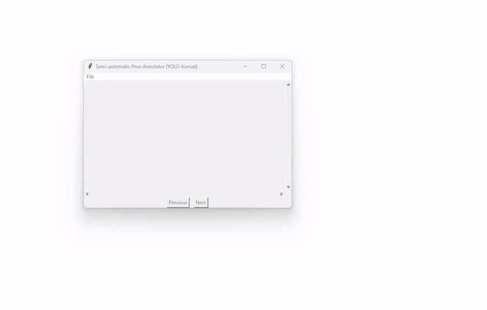

# YOLO Pose Annotation Toolset

## Overview
This repository provides a toolset for **automatic** and **semi-automatic** pose annotation to fine-tune **YOLO pose models** with custom datasets. The tool allows users to generate annotations efficiently and refine them as needed before training a fine-tuned YOLO pose model.

### Features
- **Fully automatic annotation**: Uses `YOLOv8x-pose` to detect keypoints and generate annotations automatically.
- **Semi-automatic annotation**: Provides an interactive tool to review and correct annotations.
- **Fine-tuning pipeline**: Facilitates the fine-tuning of YOLO pose models with custom datasets.



## Getting started

### 1. Clone the Repository
```bash
git clone https://github.com/kevgildea/yolo-pose-annotation.git
cd yolo-pose-annotation
```

### 2. Install Dependencies
Make sure you have Python installed (\>=3.8). Then, install the required packages:
```bash
pip install -r requirements.txt
```

### 3. Follow the Steps in the Notebook
To use the toolset, **open and follow the steps in the Jupyter notebook**:

➡️ **[YOLO Pose Annotation Pipeline Notebook](Notebooks/Tutorial.ipynb)**

This notebook provides a complete step-by-step guide on:
- Downloading and preparing the dataset
- Running automatic and semi-automatic annotation
- Fine-tuning YOLO pose models
- Running inference and visualising results


## Contributing
Feel free to submit pull requests or open issues for improvements and bug fixes!


## Acknowledgements
- This project is built using **[YOLOv8](https://github.com/ultralytics/ultralytics)** by Ultralytics.
- **[Supervision](https://github.com/roboflow/supervision)** is used for keypoint visualisation.
- Special thanks to **[Roboflow](https://roboflow.com/)** for their contributions to computer vision tools.
